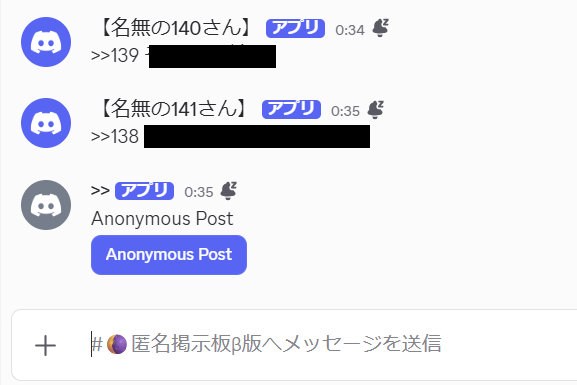
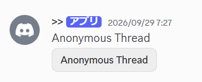
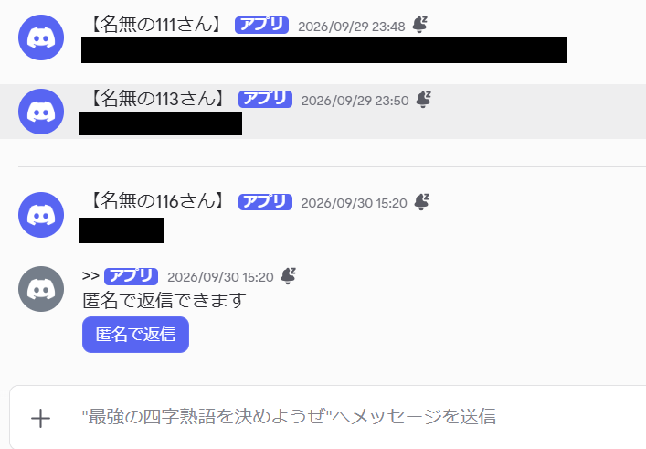

# Discord Anonymous Question Box Bot

Discordサーバーで匿名投稿・匿名スレッド・匿名返信を利用できる質問箱Botです。

通常のDiscordメッセージとは別に、Webhookを利用して投稿者名を隠し、
`【名無しさん○さん】` のような匿名名で投稿します。

---

## ✨ Features

- 🕵️ 匿名投稿
- ✏️ チャンネルへの直接投稿を匿名化
- 🧵 匿名スレッドの作成
- 💬 スレッド内での匿名返信
- 🔢 匿名番号の自動付与
- 🔄 投稿後に「Anonymous Post」ボタンを一番下へ自動移動
- 🔄 返信後に匿名返信ボタンを一番下へ自動移動
- 🔗 Webhookを利用した匿名表示
- 💾 投稿情報の保存
- ♻️ Bot再起動後も利用できるPersistent View

---
## 📷 Screenshots

### 🕵️ Anonymous Post

匿名投稿用チャンネルでは、投稿者のDiscord名を表示せず、
`【名無しさん○さん】` として投稿されます。

投稿後は `Anonymous Post` ボタンが自動的に一番下へ移動します。



### 🧵 Anonymous Thread

`Anonymous Thread` ボタンから、新しい匿名スレッドを作成できます。



### 💬 Anonymous Reply

スレッド内でも匿名で会話できます。

投稿後は「匿名で返信」ボタンが自動的に一番下へ移動します。


---

# 📌 匿名投稿

`Anonymous Post` ボタンを押すと入力画面が表示されます。

入力した内容は投稿者のDiscord名を表示せず、匿名で投稿されます。

例：

```text
【名無しさん12さん】
こんにちは！
```

投稿後、`Anonymous Post` ボタンは自動的にチャンネルの一番下へ移動します。

---

# ✏️ 直接投稿

匿名投稿用として設定したチャンネルへ直接メッセージを送信した場合も、
Botがそのメッセージを匿名投稿として処理します。

そのため、毎回ボタンを押さなくても匿名投稿できます。

---

# 🧵 匿名スレッド

`Anonymous Thread` ボタンを押すと、

- Thread name
- First message

を入力できます。

送信すると新しいスレッドが作成され、最初のメッセージが匿名で投稿されます。

---

# 💬 匿名返信

匿名スレッド内には匿名返信用のボタンが表示されます。

ボタンを押して返信内容を入力すると、Discord名を表示せず匿名で返信できます。

返信後は匿名返信ボタンがスレッドの一番下へ自動的に移動します。

---

# 🚀 Installation

## 1. Pythonをインストール

Python 3をインストールしてください。

バージョン確認：

```bash
python3 --version
```

Windows環境では、

```powershell
python --version
```

でも確認できます。

---

## 2. このリポジトリを取得

Gitを使用する場合：

```bash
git clone <YOUR_REPOSITORY_URL>
cd discord-anonymousCH
```

Gitを使用しない場合は、GitHubの

`Code → Download ZIP`

からダウンロードして展開してください。

---

## 3. 必要なライブラリをインストール

```bash
pip install -r requirements.txt
```

環境によっては、

```bash
pip3 install -r requirements.txt
```

を使用してください。

---

# 🤖 Discord Botの準備

## 1. Discord Developer Portalを開く

Discord Developer PortalでApplicationを作成し、Botを追加してください。

## 2. Bot Tokenを取得

BotページからTokenを取得します。

⚠️ **Bot Tokenはパスワードと同じように扱ってください。**

GitHub、Discord、SNSなどへ公開しないでください。

Tokenを誤って公開した場合は、Discord Developer PortalからTokenを再生成してください。

---

## 3. Message Content Intentを有効化

このBotはメッセージ内容を取得するため、

**Message Content Intent**

を使用します。

Discord Developer PortalのBot設定から有効にしてください。

---
# 🔑 Discordで必要な権限

Botには以下の権限を付与してください。

- チャンネルを表示
- メッセージを送る
- メッセージ履歴を読む
- メッセージを管理
- ウェブフックを管理
- 公開スレッドを作成
- Threadsでメッセージを送る
- スレッドを管理
- ファイルを添付

また、Discord Developer Portal の

`Bot → Privileged Gateway Intents`

から、

**MESSAGE CONTENT INTENT**

をONにしてください。

このBotは、設定されたチャンネルへの通常メッセージを読み取り、
匿名投稿へ変換するためにMessage Content Intentを使用します。
---

# ⚙️ Configuration

このリポジトリには、

```text
info.example.json
```

が含まれています。

これをコピーして、

```text
info.json
```

を作成してください。

例：

```json
{
  "token": "YOUR_DISCORD_BOT_TOKEN",
  "channel_id": 123456789012345678
}
```

## token

Discord Developer Portalで取得したBot Tokenを設定します。

```json
"token": "YOUR_DISCORD_BOT_TOKEN"
```

## channel_id

匿名投稿に使用するDiscordチャンネルのIDを設定します。

```json
"channel_id": 123456789012345678
```

`info.json` にはBot Tokenが含まれるため、公開しないでください。

`.gitignore` によってGit管理から除外されるよう設定されています。

---

# ▶️ Botを起動

Linux / macOS：

```bash
python3 main.py
```

Windows：

```powershell
python main.py
```

正常に起動すると、BotがDiscordへ接続します。

---

# ⌨️ Commands

このBotのコマンドプレフィックスは、

```text
~
```

です。

## `~panel`

匿名質問箱のパネルを表示します。

```text
~panel
```

`Anonymous Post` と `Anonymous Thread` を利用できるパネルを設置します。

## `~post`

匿名投稿ボタンを設置します。

```text
~post
```

## `~thread`

匿名スレッド作成ボタンを設置します。

```text
~thread
```

## `~set`

コマンドを実行したチャンネルを匿名投稿用チャンネルとして設定します。

```text
~set
```

設定されたチャンネルIDは `info.json` に保存されます。

## `~help`

利用可能なコマンドを表示します。

```text
~help
```

---

# 🔒 匿名性について

このBotはDiscord上では投稿者のユーザー名を表示せず、匿名として投稿します。

ただし、**Bot管理者に対する完全な匿名を保証するものではありません。**

Botは投稿に関する情報を、

```text
store.csv
```

へ保存します。

そのため、Botの管理者は保存された情報へアクセスできる可能性があります。

Botを公開サーバーなどで使用する場合は、
利用者へこの仕様を明示することを推奨します。

`store.csv` を第三者へ公開しないでください。

---

# 🔐 Security

以下の情報・ファイルはGitHubなどへ公開しないでください。

```text
info.json
store.csv
anonymous_counter.json
bot.log
.env
*.key
*.pem
*.ppk
```

特に以下は絶対に公開しないでください。

- Discord Bot Token
- Webhook URL / Token
- SSH秘密鍵
- サーバーの認証情報

このリポジトリの `.gitignore` では、
これらのファイルが誤ってGit管理されにくいよう設定しています。

---

# 🛠 Troubleshooting

## Botがオンラインにならない

以下を確認してください。

- `info.json` が存在するか
- Discord Bot Tokenが正しいか
- 必要なPythonライブラリがインストールされているか
- BotがDiscordサーバーへ招待されているか

---

## コマンドに反応しない

コマンドの先頭は `!` ではなく、

```text
~
```

です。

例えば：

```text
~panel
```

また、Discord Developer Portalで **Message Content Intent** が有効になっているか確認してください。

---

## 匿名投稿できない

Botに以下の権限があるか確認してください。

- Send Messages
- Read Message History
- Manage Messages
- Manage Webhooks

---

## スレッドを作成できない

スレッド関連の権限を確認してください。

特に、

- Create Public Threads
- Send Messages in Threads
- Manage Threads

を確認してください。

---

## 「Botが時間内に応答しませんでした」と表示される

Botを動かしているPCやサーバーが高負荷になっていたり、
Discord Gatewayとの接続が一時的に不安定になっている場合、
ボタン操作への応答が間に合わないことがあります。

Botのログやサーバーの負荷状況を確認してください。

---

# 🖥 24時間稼働について

Botを24時間稼働させる場合は、
VPSやクラウドサーバーなどで実行できます。

Linuxでは `systemd` などを使用してBotをサービス化すると、
SSHを切断した後もBotを実行し続けることができます。

> サーバー環境によって設定方法が異なるため、
> サーバーの認証情報や秘密鍵はリポジトリへ含めないでください。

---

# 📁 Files

主なファイル：

```text
discord-anonymousCH/
├── cog.py
├── main.py
├── requirements.txt
├── info.example.json
├── .gitignore
├── README.md
└── LICENSE
```

実行時には、このほかに非公開の設定・データファイルが作成または使用されます。

---

# 📄 License

ライセンスについては [LICENSE](LICENSE) を確認してください。

---

# ⚠️ Disclaimer

このBotを利用するサーバーのルールおよびDiscordの利用規約に従って使用してください。

匿名機能が迷惑行為や不正利用に使用されないよう、
サーバー管理者が適切に管理してください。
